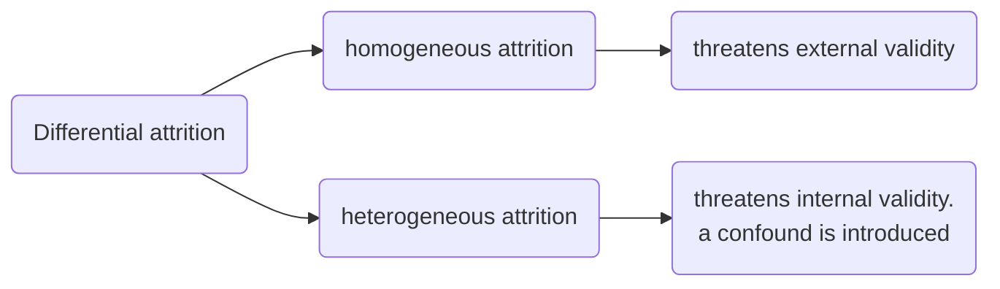

---
{"dg-publish":true,"permalink":"/lecture-notes/sem6/brsm/quiz1/"}
---

# BRSM
## L01
- Confounding variables
- Replication Crisis
- Dead Salmon study
- Null hypothesis

### Dead Salmon Study
- highlights the multiple comparison problem

### Belief Bias effect
**If you ask people to decide whether a particular argument is logically valid (i.e., conclusion would be true if the premises were true), we tend to be influenced by the believability of the conclusion, even when we shouldn’t.**

- [What are valid and invalid arguments?](https://www.thinkinglsat.com/articles/valid-and-invalid-arguments#:~:text=An%20invalid%20(i.e.%20flawed)%20argument,where%20the%20argument%20went%20wrong.)

### [Simpson’s Paradox](https://plato.stanford.edu/entries/paradox-simpson/)
**Simpson’s Paradox is a statistical phenomenon where an association between two variables in a population emerges, disappears or reverses when the population is divided into subpopulations. For instance, two variables may be positively associated in a population, but be independent or even negatively associated in all subpopulations.**

### [Base Rate Fallacy](https://www.scribbr.com/fallacies/base-rate-fallacy/)

- form of a cognitive bias
- it means when a person tend to ignore commonly understood(statistically relevant) information when new information is provided
- When provided with both individuating information, which is specific to a certain person or event, and base rate information, which is objective, statistical information, we tend to assign greater value to the specific information and often ignore the base rate information altogether. This is referred to as the _base rate fallacy_ or base rate neglect. [Read more](https://thedecisionlab.com/biases/base-rate-fallacy)

### Statistical power
**Statistical power**, or sensitivity, is the likelihood of a [significance test](https://www.scribbr.com/statistics/statistical-tests/) detecting an effect when there actually is one.

### Reliability and Validity
**_reliability_** of a measure tells you how _precisely_ you are measuring something, whereas the ***validity*** of a measure tells you how _accurate_ the measure is.

#### Reliability
- **_Test-retest reliability_**. This relates to consistency over time: if we repeat the measurement at a later date, do we get a the same answer?
- **_Inter-rater reliability_**. This relates to consistency across people: if someone else repeats the measurement (e.g., someone else rates my intelligence) will they produce the same answer?
- **_Parallel forms reliability_**. This relates to consistency across theoretically-equivalent measurements: if I use a different set of bathroom scales to measure my weight, does it give the same answer?
- **_Internal consistency reliability_**. If a measurement is constructed from lots of different parts that perform similar functions (e.g., a personality questionnaire result is added up across several questions) do the individual parts tend to give similar answers.
#### Experimental Research
##### [Confounding Variables](https://www.scribbr.com/methodology/confounding-variables/)
Confounding variables (a.k.a. confounders or confounding factors) are a type of [extraneous variable](https://www.scribbr.com/methodology/extraneous-variables/) that are related to a study’s [independent and dependent variables](https://www.scribbr.com/methodology/independent-and-dependent-variables/). A variable must meet two conditions to be a confounder:
- It must be [correlated](https://www.scribbr.com/methodology/correlational-research/) with the independent variable. This may be a causal relationship, but it does not have to be.
- It must be causally related to the dependent variable.

#### Validity
- Internal validity
- External validity
- Construct validity
- Face validity
- Ecological validity
##### Internal Validity
**_Internal validity_** refers to the extent to which you are able draw the correct conclusions about the causal relationships between variables
##### External validity
The external validity is threatened by the choice of population if 
(a) the population from which you sample your participants is very narrow (e.g., psych students), and 
(b) the narrow population that you sampled from is systematically different from the general population, _in some respect that is relevant to the psychological phenomenon that you intend to study_.

##### Face validity
- people will often use face validity as a proxy for real validity.

#### Threat to Validity

- **_Confound_**: A confound is an additional, often unmeasured variable[10](https://learningstatisticswithr.com/book/studydesign.html#fn10) that turns out to be related to both the predictors and the outcomes. The existence of confounds threatens the internal validity of the study because you can’t tell whether the predictor causes the outcome, or if the confounding variable causes it, etc.
- **_Artifact_**: A result is said to be “artifactual” if it only holds in the special situation that you happened to test in your study. The possibility that your result is an artifact describes a threat to your external validity, because it raises the possibility that you can’t generalise your results to the actual population that you care about.

**As a general rule** ***confounds are a bigger concern for non-experimental studies***, precisely because they’re not proper experiments: by definition, you’re leaving lots of things uncontrolled, so there’s a lot of scope for confounds working their way into your study. Experimental research tends to be much less vulnerable to confounds: the more control you have over what happens during the study, the more you can prevent confounds from appearing.

However, there’s always swings and roundabouts, and when we start thinking about artifacts rather than confounds, the shoe is very firmly on the other foot. For the most part, ***artifactual results tend to be a concern for experimental studies than for non-experimental studies***. To see this, it helps to realise that the reason that a lot of studies are non-experimental is precisely because what the researcher is trying to do is examine human behaviour in a more naturalistic context.

- **_History effects_** refer to the possibility that specific events may occur during the study itself that might influence the outcomes
- **_maturational effects_** are fundamentally about change over time. However, maturation effects aren’t in response to specific events. Rather, they relate to how people change on their own over time: we get older, we get tired, we get bored, etc. Some examples of maturation effects:
	- When doing developmental psychology research, you need to be aware that children grow up quite rapidly. So, suppose that you want to find out whether some educational trick helps with vocabulary size among 3 year olds. ***One thing that you need to be aware of is that the vocabulary size of children that age is growing at an incredible rate*** (multiple words per day), all on its own. If you design your study without taking this maturational effect into account, then you won’t be able to tell if your educational trick works.
	- When running a very long experiment in the lab (say, something that goes for 3 hours), it’s very likely that people will begin to get bored and tired, and that this maturational effect will cause performance to decline, regardless of anything else going on in the experiment
- ***Selection bias*** - Refers to anything that makes the groups being compared different in some potentially critical aspect
- **_differential attrition_**

- [Regression to the mean](https://www.scribbr.com/research-bias/regression-to-the-mean/)
- ***Experimenter Bias***

		“Pygmalion effect”: if you expect great things of people, they’ll rise to the occasion; but if you expect them to fail, they’ll do that too. In other words, the expectations become a self-fulfilling prophesy.

	- ***Demand effects and reactivity***
		- The _good participant_ tries to be too helpful to the researcher: he or she seeks to figure out the experimenter’s hypotheses and confirm them.
		- The _negative participant_ does the exact opposite of the good participant: he or she seeks to break or destroy the study or the hypothesis in some way.
		- The _faithful participant_ is unnaturally obedient: he or she seeks to follow instructions perfectly, regardless of what might have happened in a more realistic setting.
		- The _apprehensive participant_ gets nervous about being tested or studied, so much so that his or her behaviour becomes highly unnatural, or overly socially desirable.
	- The **_placebo effect_** is a specific type of demand effect

Solution to experimenter bias
- The general solution to the problem of experimenter bias is to engage in **double blind studies**, ==where neither the experimenter nor the participant knows which condition the participant is in, or knows what the desired behaviour is==

### Frequentist Statistics
#### Desirable Characteristics:
1. **Objective:**
    - Probability is grounded in the physical world.
    - Probability statements relate to events occurring in the universe.
2. **Unambiguous:**
    - Different observers calculate the probability of an event consistently.

#### Undesirable Characteristics:
1. **Infinite Sequences:**
    - Physical world constraints challenge the concept of infinite sequences.
    - Events like infinite coin flips may not align with the real-world scenario.
2. **Narrow Scope:**
    - Frequentist definition has limitations in dealing with one-time events.
    - Single, non-repeatable events lack a probability assignment according to frequentist perspective.
3. **Challenges in Real-World Scenarios:**
    - Example: Meteorologist forecasting a 60% chance of rain for a specific date.
    - Frequentist probability struggles to define probabilities for unique, non-repeated events.

#### Overcoming Challenges:
- Frequentists may employ unconventional approaches, like defining probabilities for categories of events.
- Example: Meteorologist might mean, "On days I predict a 60% chance of rain, it actually rains on 60% of those days."

#### Note:
- Frequentist probability may require creative interpretations for scenarios involving unique events.
- Limitations may lead to counterintuitive formulations, challenging conventional understanding

### Bayesian Statistics
#### Characteristics:
- Also known as the subjectivist view.
- Gaining traction among statisticians in recent decades.

#### Definition:
- Probability is the degree of belief assigned by an intelligent and rational agent to the truth of an event.
- Probabilities exist in the thoughts and assumptions of individuals, not in the external world.

#### Operationalization:
- "Degree of belief" can be operationalized through rational gambling.
- Example: Probability of rain is 60%, willing to accept a bet on rain for a positive outcome.

#### Advantages:
- Allows assigning probabilities to any event, not limited to repeatable events.

#### Disadvantages:
- Subjectivity requires an intelligent agent with relevant beliefs.
- Some find it uncomfortable as it seems to make probability arbitrary.

#### Rationality:
- Requires the agent to be rational, adhering to the rules of probability.
- Allows diverse beliefs; different observers can have different beliefs about the same event.

#### Comparison with Frequentist View:
- Frequentist view is considered narrow, forbidding assigning probabilities to certain scenarios.
- Bayesian view is sometimes seen as broad, allowing differences between observers in their beliefs about the same event.

### Some probability distributions
- [probably the best description](https://www.youtube.com/watch?v=Uv6nGIgZMVw&ab_channel=jbstatistics)
- https://analystprep.com/cfa-level-1-exam/quantitative-methods/t-distribution-and-degrees-of-freedom/
- https://pressbooks.bccampus.ca/simplestats/chapter/6-8-the-t-distribution/

### Biased and unbiased estimator
An estimator is unbiased _if it's expectation is equal to the parameter that we're trying to estimate_.
- [a pdf](https://www.statslab.cam.ac.uk/Dept/People/djsteaching/S1B-15-02-estimation-bias-4.pdf)
- https://www.probabilitycourse.com/chapter8/8_2_1_evaluating_estimators.php