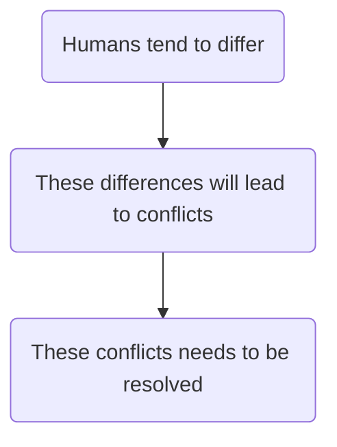
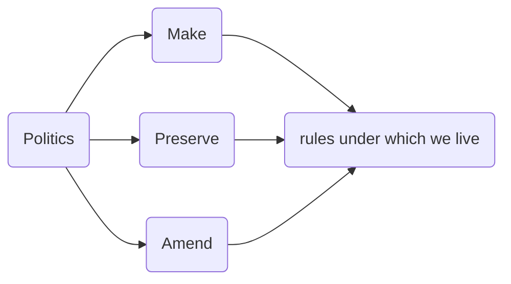
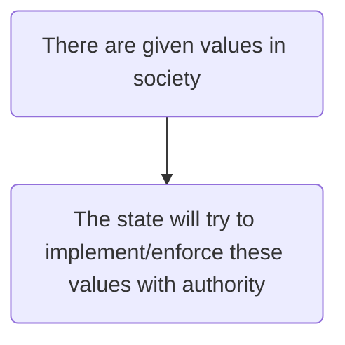
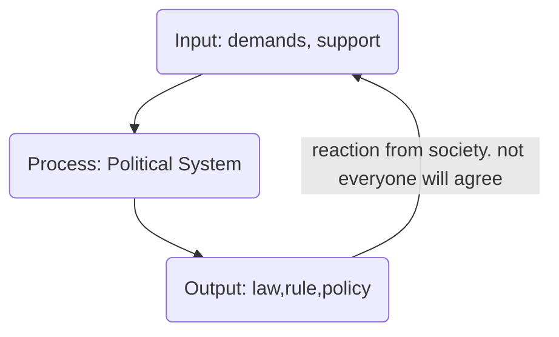

---
{"dg-publish":true,"permalink":"/lecture-notes/sem6/ihs/politics/l02/"}
---

# **IHS - L02**
# Political Science - Session 1
##### $8^{th}$ Jan, 24
## What is politics?
"He does lot of politics". What does it mean when we say this?

"Polis" - Greek word: city or state

### Different Interpretations

#### Aristotle - Father of political sciences
> A human being is a naturally political animal

**Possible interpretation**:-

Since politics is an "essentially contested" concept, it has a number of legitimate and accepted definitions.

The rules keep changing. If a rule is made, it needs to be preserved, which is what typically a system does.

#### Bismark
> Politics is art.

#### Davis Easton
> authoritative allocation of values

#### Lord Acton
- ==Power: capacity/capability to influence decision of others without doing anything==. If you do something, that is force
- Power needs to be attained and sustained

#### Politics as Public Affairs
> Personal is political
- Marital Rapes - legal or illegal?
#### Politics as Compromise and Consensus
> Who compromises is a game of power.

**In a truly democratic system, there are no additional qualifications added to be eligible to stand for elections so as to not prevent even a single person from becoming ineligible for the position. Otherwise doing so would have prevented someone or the other from standing in elections.**

#### Philosophical Tradition
**What should happen?**
#### Empirical Tradition