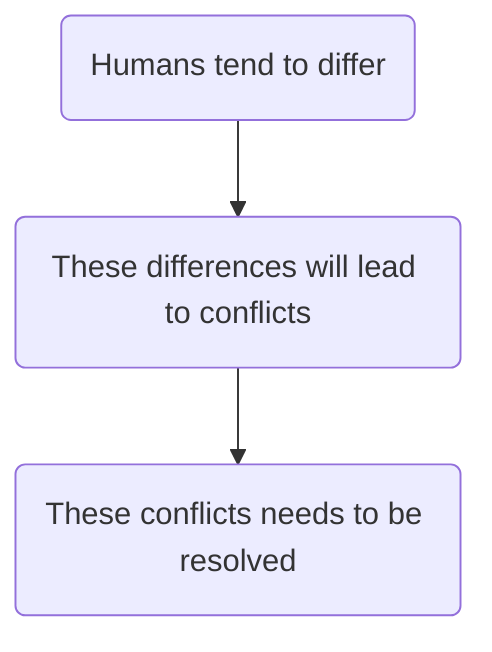
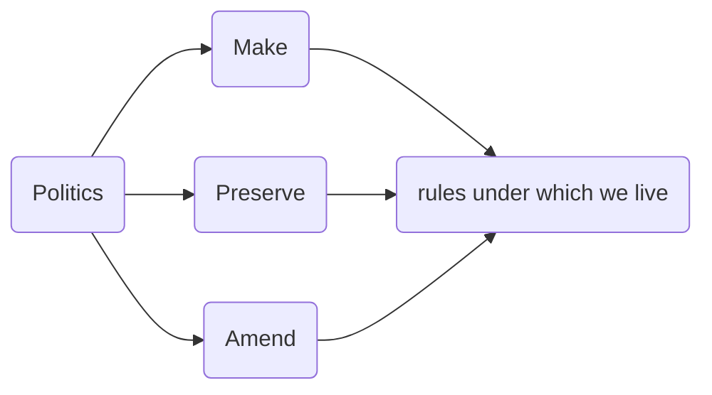
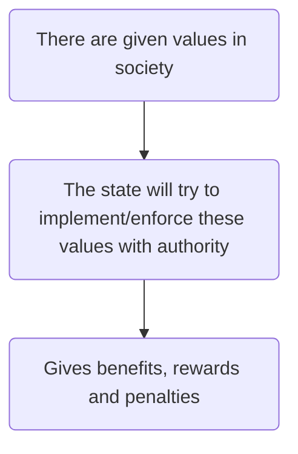
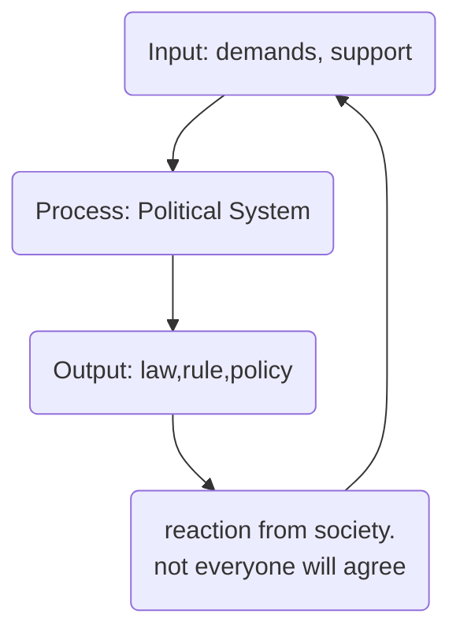

---
{"dg-publish":true,"permalink":"/lecture-notes/sem6/ihs/politics/l02/"}
---

# **IHS - L02**
# Political Science - Session 1
##### $8^{th}$ Jan, 24
## What is politics?
"He does lot of politics". What does it mean when we say this?

"Polis" - Greek word: city or state

### Different Interpretations
#### Aristotle - Father of political sciences 
	Hence it is evident that the state is a creation of nature, and that man is by nature a political animal. And he who by nature and not by mere accident is without a state, is either above humanity, or below it; he is the ‘Tribeless, lawless, hearthless one,’ whom Homera denounces—the outcast who is a lover of war; he may be compared to a bird which flies alone.

~ [Aristotle](https://oll.libertyfund.org/people/aristotle/quotes)
> A human being is a naturally political animal

##### Thoughts

Aristotle’s statement that man is a “political animal” can be taken in a number of ways. 
- One interpretation suggests that humans are naturally sociable and drawn to political associations to satisfy their social needs (the [Pufendorf](https://oll.libertyfund.org/person/samuel-von-pufendorf)-[Grotius](https://oll.libertyfund.org/person/hugo-grotius) line).
- Alternatively, a less charitable interpretation views the word "political" as emphasizing the violent and coercive nature of politics, highlighting the "animal" side of human nature over its rational and cooperative aspects.
- According to Aristotle, those who reject politics also reject society, rendering themselves outcasts without a community or empathy.
- This rejection is likened to being a "bird which flies alone," reminiscent of Rudyard Kipling's story "The Cat who walked by Himself" from The Just So Stories.
- The choice to reject mainstream paths, as suggested in Robert Frost's poem "The Road not Taken," may not necessarily be negative.
### Politics is inextricably linked to the phenomena of conflict and cooperation
**Possible interpretation**:-

Since politics is an "essentially contested" concept, it has a number of legitimate and accepted definitions.

The rules keep changing. If a rule is made, it needs to be preserved, which is what typically a system does.

#### Bismark
- Politics is art.
- It is the art of Government
- the exercise of control in society through making and enforcement of collective decisions 

#### Davis Easton
- authoritative allocation of values
- Values in this sense are goods that serve as the objects of human de- sires, i.e., **'valued thing'**

#### Lord Acton
	Power tends to corrupt. Absolute power corrupts absolutely

If you have absolute power over people, the temptation will be great for you to overcome rules (if there are any rules left). So you will allow people to obtain favours in exchange for money or other advantages, and you will obtain people’s favours in the same way or simply by asking them in the name of your authority. In other words, you will be both corruptor and corrupted, your absolute power will corrupt you absolutely, that is totally, completely.
- Power: *capacity/capability to influence decision of others without doing anything*. If you do something, that is force
- Power needs to be attained and sustained

#### Politics as Public Affairs
- the distinction between ‘the political’ and ‘the non-political’ coincides with the division between an essentially public sphere of life and what can be thought of as a private sphere
- ***Personal is political***
- Marital Rapes - legal or illegal?
#### Politics as Compromise and Consensus
> Who compromises is a game of power.

**In a truly democratic system, there are no additional qualifications added to be eligible to stand for elections so as to not prevent even a single person from becoming ineligible for the position. Otherwise doing so would have prevented someone or the other from standing in elections.**

#### Philosophical Tradition
**What should happen?**
#### Empirical Tradition