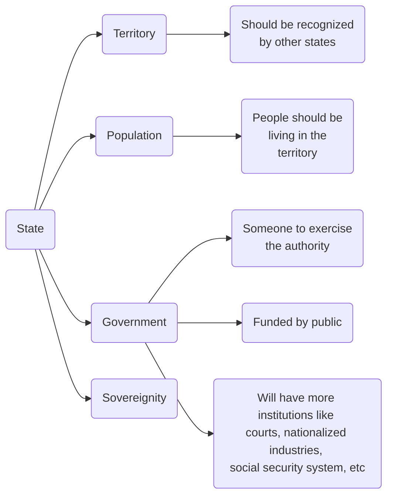
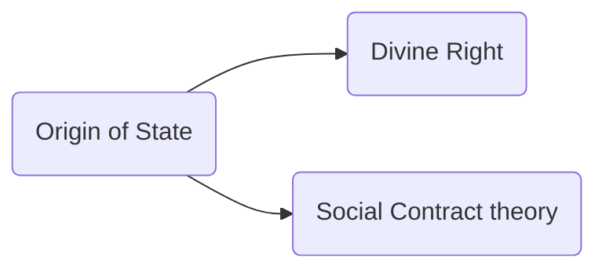
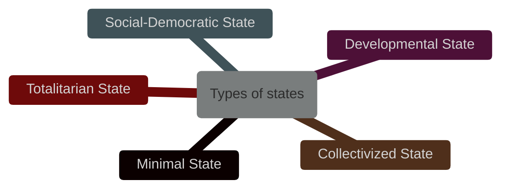
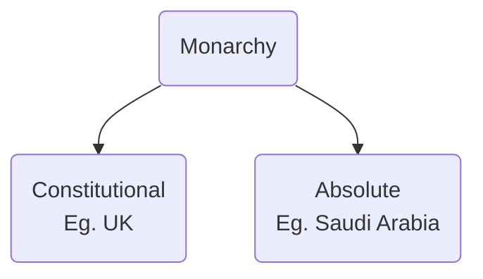
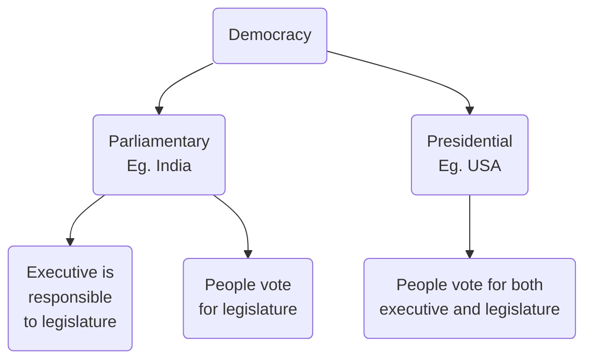
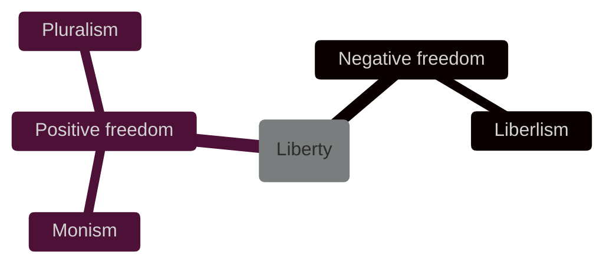

---
{"dg-publish":true,"permalink":"/lecture-notes/sem6/ihs/politics/l03/"}
---

# **IHS - L03**
# Political Science - Session 2
##### $11^{th}$ Jan, 24
# Topics covered
- [State](#State)
- [Government](#Government)
- [Liberty](#Liberty)
- [Equality](#Equality)

# State
## Definition
A **state** (also called a nation or country) is a territory with defined boundaries organized into a political unit and ruled by an established government that has control over its internal and foreign affairs. When a state has total control over its internal and foreign affairs, it is called a **sovereign state**. A location claimed by a sovereign state is called a **territory**. According to the United Nations, in 2016, the world had 193 nations; however, many of those nations dispute their boundaries.

## Origin of State

### Divine Right
- rulers are chosen by god
- *Monarchical absolutism*: **ruled by a king or queen**
### Social Contract Theory
- Taxes
- Give up your rights to secure your own life
## Role of the State

- **Minimal State**
	- just a protective body
	- provide peace and social order
	- people will live their life as they think best (within this order)
- **Developmental State**
	- intervenes in economy to promote *industrial development* and *economic development*
- **Social Democratic State**
	- intervenes in the economy to achieve broader social restructuring based on principles like *fairness*, *equality*, and *social justice*.
- **Collectivized State**
	- exercises complete control over economic life, bringing it all under state authority.
- **Totalitarian State**
	- Seeks total control over every aspect of human existence, including the economy, education, culture, religion, and family life.

# Government
## Definition
- Mechanism through which ordered rule is maintained
- Ability to make collective decision and capacity to enforce them
## Functions
- Make law (legislation)
- Implement law (execution)
- Interpretation of law (adjudication)
## Types
- [Monarchy](#monarchy) (Constitutional & Absolute)
- [Democracy](#democracy) (Parliamentary & Presidential)
- Communism
- Socialism
- Aristocracy
- Oligarchy
- Military Dictatorship
- Theocracy
- Totalitarianism
- Colonialism
### Monarchy

### Democracy

# Liberty
## Definition
- notion of choice
- absence of constraints to make and exercise the choice
- existence of conditions that enable you to actuate the choice

- In broad terms, negative liberty means freedom from interference, coercion, or restraint-while positive liberty means freedom to, or self-determination-freedom to act or to be as one wills
# Equality
## Definition
- In everyday language, equality usually means things being the same. But in politics, it's about treating people fairly in laws and political situations.
- It's about making sure everyone has a fair share of important things in society, like opportunities, resources, and rights, to reflect their equal worth.
- Marxism, a belief system, says equality should exist between different social classes. It focuses on how entire groups are treated, not just individuals.
- Marxism warns against only looking at individual differences and says we need to address larger, systemic issues causing inequality.

Examples
- *Equality of Opportunity* - ‘Right to be unequal’, focus on chances
	- for example, if something is done by the state to give advantage to those who are underprivileged, that will not be violation of equality but if doing something to give advantage to already privileged, that is violation of equality 
- *Equality of Outcome* - Focus on rewards
- *Equality of Welfare* - Fulfill everyone’s welfare equally irrespective of the inequality entailed in the distribution of resources.
- *Equality of Resources* - A distributional scheme should treat people as equals ‘when it distributes or transfers the resources’.
- *Equality of Capabilities* - A capability is the ability to achieve a certain sort of function. For example, literacy is a capability, while reading is a function.
#### Miscellaneous
- White Men's Burden theory
- Two Wheels Theory of State
- Preamble of India