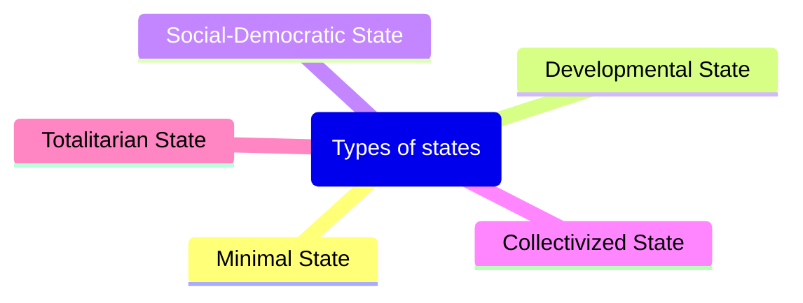
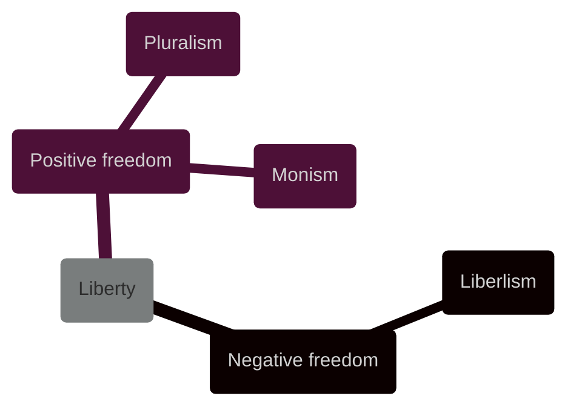

---
{"dg-publish":true,"permalink":"/lecture-notes/sem6/ihs/politics/l03/"}
---

# **IHS - L03**
# Political Science - Session 2
##### $11^{th}$ Jan, 24
# Topics covered
- [State](#State)
- [Government](#Government)
- [Liberty](#Liberty)
- [Equality](#Equality)

# State
## Definition
A **state** (also called a nation or country) is a territory with defined boundaries organized into a political unit and ruled by an established government that has control over its internal and foreign affairs. When a state has total control over its internal and foreign affairs, it is called a **sovereign state**. A location claimed by a sovereign state is called a **territory**. According to the United Nations, in 2016, the world had 193 nations; however, many of those nations dispute their boundaries.

## Origin of State

### Divine Right
- rulers are chosen by god
- ==Monarchical absolutism: **ruled by a king or queen**==
### Social Contract Theory
- Taxes
- Give up your rights to secure your own life
## Role of the State

# Government
## Definition
- Mechanism through which ordered rule is maintained
- Ability to make collective decision and capacity to enforce them
## Functions
- Make law (legislation)
- Implement law (execution)
- Interpretation of law (adjudication)
## Types
- [Monarchy](#monarchy) (Constitutional & Absolute)
- [Democracy](#democracy) (Parliamentary & Presidential)
- Communism
- Socialism
- Aristocracy
- Oligarchy
- Military Dictatorship
- Theocracy
- Totalitarianism
- Colonialism
### Monarchy

### Democracy

# Liberty
## Definition
- notion of choice
- absence of constraints to make and exercise the choice
- existence of conditions that enable you to actuate the choice

# Equality
## Definition