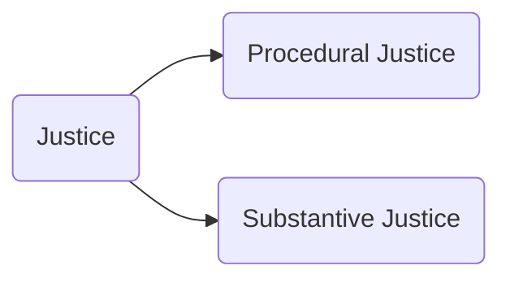

---
{"dg-publish":true,"permalink":"/lecture-notes/sem6/ihs/politics/l04/"}
---

# **IHS - L04**
# Political Science - Session 3
##### $15^{th}$ Jan, 24
# Topics covered
- [Justice](#Justice)
- [Rights](#Rights)
- [Democracy](#Democracy)
- [Citizenship](#Citizenship)
- [Power](#Power)
- [Authority](#Authority)
- [Legitimacy](#Legitimacy)

# Justice
## Definition
- In its ordinary meaning, the term suggests behaviour and treatment of an individual that is fair, reasonable and justified. 
- When translated into politics, however, we find that it is articulated around different demands such as procedural justice, moral conceptions of justice and distributive theories of justice.

### Procedural Justice
- refers to mechanisms of legal justice such as *stable* and *consistent* laws and processes that apply to all citizens equally
- requires presumption that the accused is ***innocent until proven guilty***

### Substantive Justice
- This is concerned with the content of the law.
- whether the rules themselves are just or not
- notions of justice vary from individual to individual, from group to group, from society to society, and from period to period.

# Rights
## Definition
- a right is to get ‘one’s due’, i.e. to get what is due to someone as a human, citizen, individual or as a member of a group, etc. 
- To have a right is to be entitled to do something or to have something done; for example, to vote, to speak, to avail of healthcare, etc.
- **the rights that we have are against the state**
- rights when given by constitution are called _fundamental rights_

### Example
#### Human Rights
	Human rights are rights inherent to all human beings, regardless of race, sex, nationality, ethnicity, language, religion, or any other status. Human rights include the right to life and liberty, freedom from slavery and torture, freedom of opinion and expression, the right to work and education, and many more.  Everyone is entitled to these rights, without discrimination.

1. __security rights__ that protect people against crimes such as murder, massacre, torture and rape;
2. __liberty rights__ that protect freedom in areas such as belief, expression, association, assembly and
movement;
3. __political rights__ that protect the liberty to participate in politics through actions such as
communicating, assembling, protesting, voting and serving in public office;
4. __due process rights__ that protect against abuses of the legal system such as imprisonment without
trial, secret trials and excessive punishments;
5. __equality rights__ that guarantee equal citizenship, equality before the law and non-discrimination;
6. __welfare rights__ (or ‘economic and social rights’) that require the provision of education to all
children and protections against severe poverty and starvation.

### Negative Rights
are rights where society doesn't interfere with you. For instance, the right to life means others can't harm you, but they don't have to actively help you live well or be happy.
### Positive Rights
are rights that require others or the government to do something to ensure you can fully enjoy your rights. For instance, the right to health or basic needs means others have to take action to provide healthcare or necessary resources.

# Democracy
## Definition
- Democracy is a government based on political equality, where consent of all individuals in the political community is necessary.
- It operates on the beliefs that 
	- all people are equally capable of making collective decisions that affect their lives
	- every person's opinion holds equal value, reflected in the principle of 'one person one vote'
- It believes that everyone is equally important and should be included, without favoring certain people or groups.
- Diversity of opinions and interests is expected and celebrated in democracy, considered a strength that requires tolerance for all viewpoints.

## Direct and Indirect Democracy
### Direct Democracy
- involves citizens collectively deciding major issues through mass meetings.
- This form of democracy lets people rule themselves, resembling ancient Athens.
- Examples include the ***gram sabha*** in India and modern practices like referendums, initiatives, and recalls.
### Indirect Democracy
- (or representative democracy) works through elected representatives.
- Representatives act as a link between the government and the people.
- People control their representatives through elections to prevent abuse of power.

# Citizenship
	Citizenship is a legal bond between a person and a country.
A citizen is someone in a political community who enjoys the rights and also responsibilities that come with being a citizen

Citizenship has three main parts:
- *Legal status*: Being free to act within the law and having rights, even if not involved in making laws.
- *Political involvement*: Actively taking part in a society's political systems.
- *Membership in a community*: Being part of a group that gives a unique sense of identity.

# Power
- Power, according to *Robert Dahl*, is when one person (A) gets another person (B) to do something they wouldn't do otherwise.
- Understanding power involves looking at the resources and abilities A uses to influence B.
- In domestic politics, power often lies with those in authority, while in International Relations, realists like *Hans Morgenthau* link power to military strength.
- *Joseph Nye* introduces the concept of 'soft power', which is the ability to make others want the same outcomes as you without force, achieved through attraction rather than coercion.

# Authority

- Authority is the right to be obeyed or the ability to have decisions followed without coercion or persuasion.
- It differs from power as it doesn't rely on threats or incentives.
- For example, a thief using force or a fraudster using persuasion don't exert authority, but a government can collect taxes based on its legitimate authority.
- Max Weber identified three types of authority:
  - Legal-rational: Based on rules.
  - Traditional: Rooted in history.
  - Charismatic: Stemming from personal charisma.

# Legitimacy
- Legitimacy, from the Latin word 'legitimare' meaning 'to declare lawful'
- essentially signifies 'rightfulness'.
- gives an order/command an authoritative/binding character, thereby converting power into authority.
- Legitimacy is used by political actors to justify their right to govern.
- It has two main parts: 
	- a legal right to authority, which is a technical matter, and 
	- valid recognition by others of the right to make decisions.
- Legitimacy can exist without recognition, as seen in apartheid laws in South Africa.
- In international relations, legitimacy is crucial for debates on ethics and humanitarian intervention.
- The concept of legitimacy was significant during the 2003 Iraq war, especially regarding the authority of the United Nations Security Council to use force.
- Supporters justified the conflict based on the need to disarm Iraq of weapons of mass destruction, which were never found.

#### Miscellaneous
- *Republic*: head of state is elected (President)
- *Secularism*: state will not have any religion
- UK is democracy but not republic (raaja ka beta raaja)
