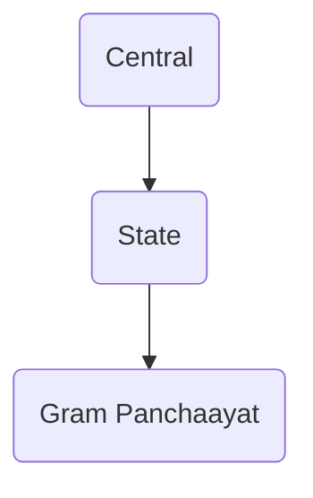

---
{"dg-publish":true,"permalink":"/lecture-notes/sem6/mmt/l05/"}
---

# **IHS - L05**
# Political Science - Session 4
##### $18^{th}$ Jan, 24
# Topics covered
- [Indian Constitution](#Indian_Constitution)

# Indian Constitution
- Constitution is a rule-book to make laws
## Features
- Federal System with Unitary Bias
	- Federalism is a system of government in which the power is divided between a central authority and various constituent units of the country. 
	- Usually, a federation has two levels of government. One is the government for the entire country that is usually responsible for a few subjects of common national interest. 
	- The others are governments at the level of provinces or states that look after much of the day-to-day administering of their state. Both these levels of governments enjoy their power independent of the other.
	- Indian Constitution provides for a federal system with a unitary bias. 
	- The Union List subjects are governed by the Central government, whereas the State List is governed by the states. 
	- States in India, unlike states in the United States, do not have the power to write their own constitutions. 
	- The term "unitary bias" comes from the fact that the Central Government has residuary powers. 
	- The Indian federal system is based on the Canadian model
- Universal Adult Franchise
	- one person, one vote
	- required age to vote is same for all
	- no discrimination
- Three-Tier Government

## Fundamental Rights
- _Article 18_ - Abolition of Titles
	- Except in field of education and Armed Forces

# President of India
- Head of the State
## Appointment
- The President of India is elected indirectly by an electoral college consisting of:
	- Elected members of both houses of Parliament.
	- Elected members of the Legislative Assemblies of States and Union territories.
- The election is conducted using a system of proportional representation by means of the single transferable vote.
	- This means that voters rank candidates in order of preference. If a candidate receives more votes than required to win, the surplus votes are transferred to other candidates according to the voters' preferences. This process continues until a candidate secures the required majority of votes to be elected as the President.
- The candidate who secures a simple majority of votes becomes the President.
- If no candidate receives a majority in the first round, second and subsequent rounds of counting take place until a winner is determined.

## Qualification
- He should be an Indian Citizen
- His age should be a minimum of 35 years
- He should qualify the conditions to be elected as a member of the Lok Sabha
- He should not hold any office of profit under the central government, state government, or any public authority
	- The term "*office of profit*" refers to a position or office under the government that yields financial gain, directly or indirectly, to the officeholder